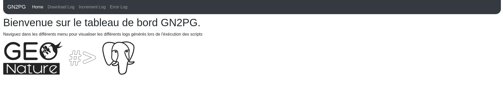
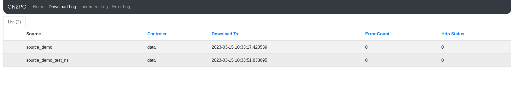

Dashboard
=========

Presentation
############

This is the documentation to install dashboard for the gn2pg_cli. 
This dashboard allow the user to get readonly view for the table generate with 
``gn2pg_cli --json-tables-create <myconfigfile>``

Here are some pictures of dashboarg gn2pg :

Installation
############

If you want to install the dashboard , follow these instructions:

1. Copy locally project source code
~~~~~~~~~~~~~~~~~~~~~~~~~~~~~~~~~~~

Get locally the latest release from GitHub repo, e.g. for version 1.5.0.

.. code-block:: bash

    wget https://github.com/lpoaura/GN2PG/archive/refs/tags/v1.5.0.tar.gz
    tar xzf v1.5.0.tar.gz
    mv GN2PG-1.5.0/ gn2pg

2. Config settings.ini
~~~~~~~~~~~~~~~~~~~~~~

First you must have follow all steps of documentation to use ``gn2pg_cli``
in the :ref:`how-to` doc (at least ``gn2pg_cli --init <myconfigfile>`` && ``gn2pg_cli --json-tables-create <myconfigfile>``.
Indeed the dashboard uses information given in your ``~/.gn2pg/config.toml``

* File ``~/.gn2pg/config.toml``
  
    .. code-block:: toml

        # GN2PG configuration file
        
        # Local db configuration
        [db]
        db_host = "localhost"
        db_port = 5432
        db_user = "<dbUser>"
        db_password = "<dbPassword>"
        db_name = "<dbName>"
        db_schema_import = "schema"

After that you have to create and fill the file : ``setting.ini`` based on the example file ``settings.ini.sample``
You will find this file at : ``install/settings.ini.sample``

* File ``install/settings.ini.sample``

    .. code-block:: toml

        GN2PG_CONFIG_NAME=gn2pgconfig
        APPLICATION_ROOT=/gn2pg
        SERVER_NAME=localhost
        SECRET_KEY=default-secret-key-to-change-with-strong-one
        GUNICORN_WORKERS=4
        GUNICORN_TIMEOUT=30
        GUNICORN_PORT=5001

2.a Installation for production
~~~~~~~~~~~~~~~~~~~~~~~~~~~~~~~

Go into the ``install`` folder and then execute script:

1. ``./01_set_config_htaccess.sh``
   
This script allow you to create user and password to protect the access to dashboard url

2. ``./02_install_app.sh``

This script add necessary package and create ``/etc/systemd/system/gn2pg.service`` and apache files 
either with new virtualhost ``etc/apache2/sites-available/gn2pg.conf`` or only config ``/etc/apache2/conf-available/gn2pg.conf``

2.b Installation for development
~~~~~~~~~~~~~~~~~~~~~~~~~~~~~~~~

Execute these lines from the root of folder gn2pg. 

.. code-block:: bash

    source /venv/bin/activate
    poetry install --extras=dashboard
    cd gn2pg
    flask run

Finally go to the url according to your ``settings.ini`` (default : ``http://127.0.0.1:5001/gn2pg``)
